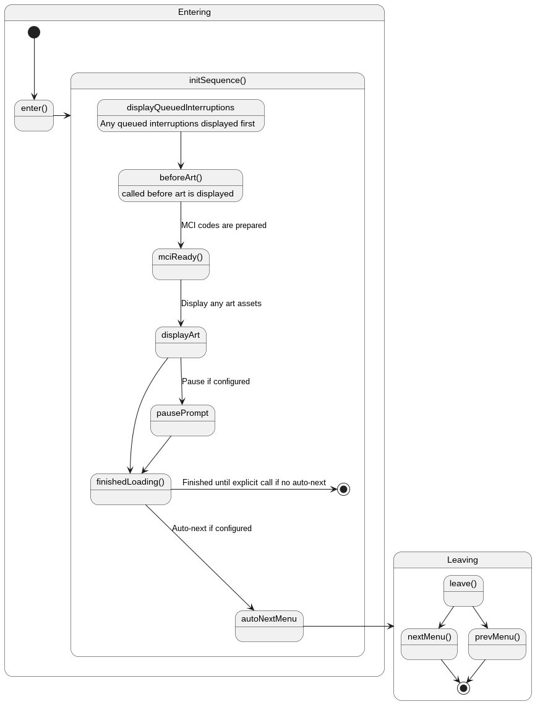

## Menu Modules
All menu entries found within `menu.hjson` are backed by *menu modules*. Menus are any screen or sectionin within the system. A main menu, a door launcher, and MRC chat are all examples of menus. For basic menus, a standard handler is implemented requiring no code. However, if you would like to create a menu that has custom handling, simply inherit from `MenuModule`. More on this below.

> :information_source: Remember that ENiGMA does not impose any stucture to your system! The "flow" of all `menu.hjson` entries is up to you!

## Creating a New Module
At the highest level, to create a new custom menu or mod, inherit from `MenuModule` and expose it via the `getModule` exported method:

```javascript
// my_fancy_module.js
exports.getModule = class MyFancyModule extends MenuModule {
  constructor(options) {
    super(options);
  }
};
```

## Lifecycle
Below is a very high level diagram showing the basic lifecycle of a menu.



Methods indicated above with `()` in their name such as `enter()` are overridable when inheriting form `MenuModule`.

## MenuModule Helper Methods
Many helper methods exist and are available to code inheriting from `MenuModule`. Below are some examples. Poke around at [menu_module.js](../../../core/menu_module.js) to discover more!

### Views & View Controller
* `displayAsset()`
* `prepViewController()`
* `prepViewControllerWithArt()`
* `displayArtAndPrepViewController()`
* `setViewText()`
* `getView()`
* `updateCustomViewTextsWithFilter()`
* `refreshPredefinedMciViewsByCode()`

### Validation
* `validateMCIByViewIds()`
* `validateConfigFields()`

### Date/Time Helpers
The following methods take a single input to specify style, defaulting to `short`:
* `getDateFormat()`
* `getTimeFormat()`
* `getDateTimeFormat()`

### Misc
* `promptForInput()`


> :information_source: Search the code for the above methods to see how they are used in the base system!
